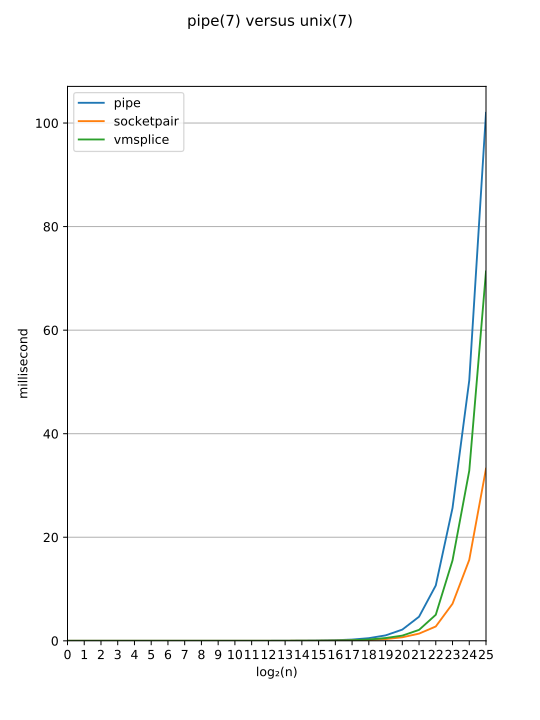

Despite unix(7) offering much more features than pipe(7),
it is much faster. There is however two features unix(7)
does not have: there is no guarantee that small writes are
atomic, there is not support for splice(2)/tee(2) which
is extremely efficient, vmsplice(2) and changing the
capacity (neither of which improves the performance
sufficiently), and file descriptor hijacking is not support.
The latter is a double-sided sword: it [the lack of support]
increases security, but other processes' file cannot be
opened and programs must treat /dev/fd/ paths especially.

send(3)/recv(3) is marginally faster than write(3)/read(3).
